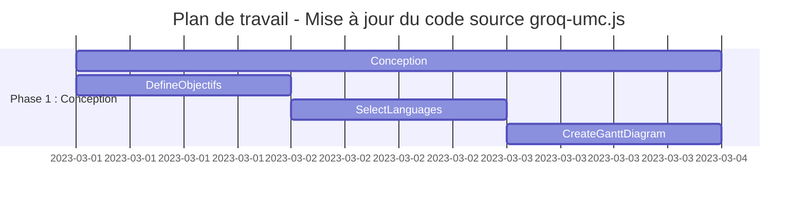
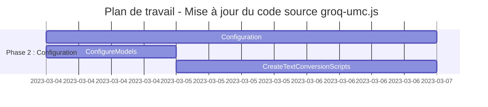
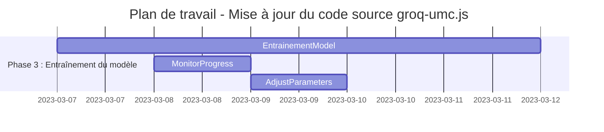
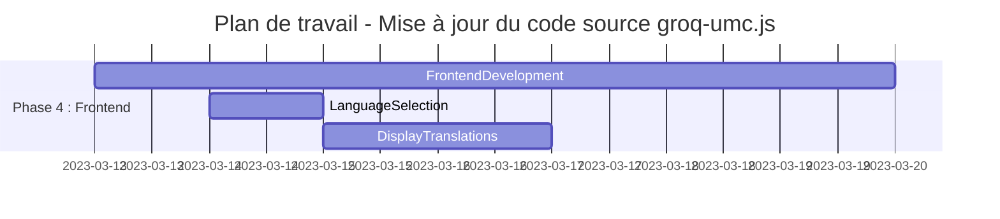
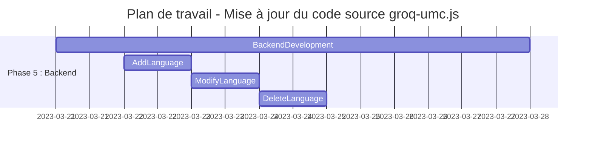
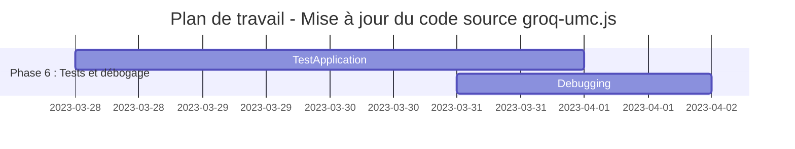
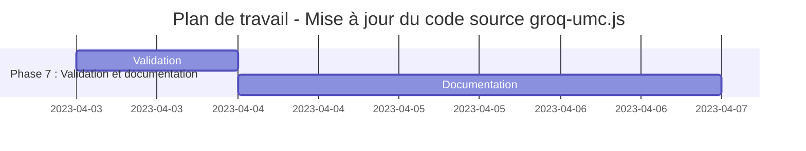
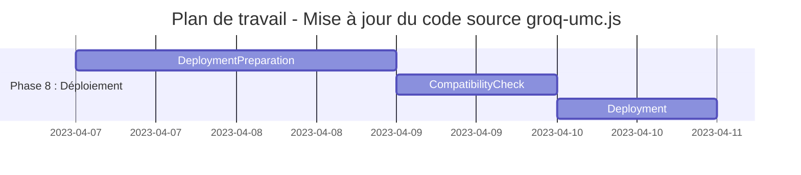
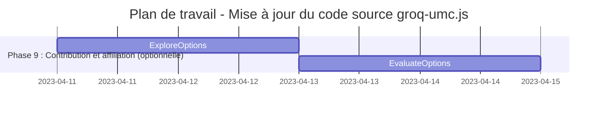

# Plan d'action - Mise à jour du code source groq-umc.js pour une plateforme de traduction

## Introduction

Je suis un Développeur logiciel spécialisé en traduction automatique, et mon rôle consiste à mettre à jour le coeur du code source groq-umc.js en JavaScript avec node\_module et groq-sdk pour une plateforme de traduction. Mon plan de travail est structuré en plusieurs phases pour garantir un résultat optimal.

## Contexte

La mise à jour du code source vise à intégrer de nouvelles langues, améliorer l'interface utilisateur et optimiser les performances de la plateforme de traduction.

## Tâche

Ma tâche consiste à réaliser une mise à jour complète du code source en suivant le plan de travail détaillé ci-dessous.

## Plan de travail

### Phase 1 : Conception - Définition des objectifs et des langues à intégrer

- Définir les objectifs de la plateforme de traduction
- Identifier et sélectionner les langues à intégrer
- Créer un diagramme de Gantt pour organiser les phases et les tâches

### Phase 2 : Configuration - Configuration des modèles de traduction et création de scripts de conversion de texte

- Configurer les modèles de traduction (gemma2, llma, gpt-4o dall-e-3)
- Créer des scripts de conversion de texte pour préparer les données d'entraînement

### Phase 3 : Entraînement du modèle - Entraînement des modèles avec des exemples de phrases

- Entraîner les modèles de traduction avec des exemples de phrases
- Suivre les progrès et ajuster les paramètres si nécessaire

### Phase 4 : Frontend - Gestion des itérations (index.html, style.css, script.js, async.json) - Développement de l'interface utilisateur (ui)

- Développer l'interface utilisateur (ui) pour la plateforme de traduction
- Intégrer les fonctionnalités de sélection de langue et d'affichage des traductions

### Phase 5 : Backend - Gestion des itérations (request.php, module.php, request.js, table.json) - Développement de l'interface de gestion

- Développer l'interface de gestion pour la plateforme de traduction
- Intégrer les fonctionnalités d'ajout, de modification et de suppression de langues

### Phase 6 : Tests et débogage - Test de l'application et correction des bugs

- Tester l'application en conditions réelles
- Corriger les bugs et optimiser les performances

### Phase 7 : Validation et documentation - Documentation des fonctionnalités et du processus de traduction

- Valider l'application et les fonctionnalités
- Rédiger la documentation pour les utilisateurs et les développeurs

### Phase 8 : Déploiement - Déploiement de l'application

- Préparer le déploiement de l'application sur la plateforme cible
- Assurer la compatibilité avec les navigateurs et les systèmes d'exploitation

### Phase 9 : Contribution et affiliation (optionnelle) - Ajout d'options pour la contribution des utilisateurs

- Explorer les options pour permettre aux utilisateurs de contribuer à l'amélioration de la plateforme de traduction
- Évaluer les avantages et les inconvénients de chaque option

## Caractéristiques de l'application

- L'application doit être fluide et intuitive
- L'application doit supporter plusieurs langues
- L'application doit offrir une précision de traduction élevée
- La documentation doit être claire et exhaustive

## Conclusion

En suivant ce plan de travail détaillé, je m'engage à réaliser une mise à jour complète du code source groq-umc.js pour une plateforme de traduction performante et conviviale.